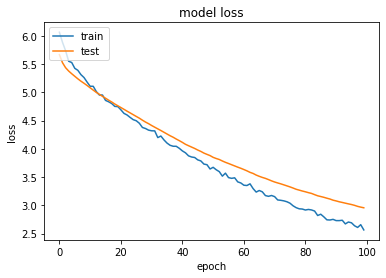
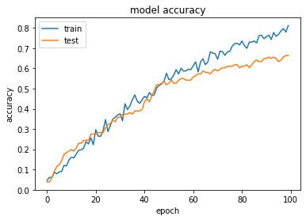

# Human-Verification-using-Multimodal-Deep-Learning


This project explores the use of an aggregate network to verify the identity of a person using his facial and speech data.
The conventional method of deep learning is used to process huge amounts of a certain type of data to do a certain job. 
But us humans don't process data in a similar fashion. We use both audio and visual cues to understand data. 
The objective of this project is to explore how deep learning models can perceive data in a similar way. 

We thus applied this concept to make a Multimodal Network that helps us verify the identity of a person. The idea is to make a neural 
network that can incorporate multimodalities and train with less amounts of data.

***
## Siamese Network

Our deep learning model uses a siamese network to perform a one-shot learning task from the aggregated features of both the individual face and audio networks. Using a metric space method we have trained the model to identify if two given data points belong to the same class or not.

<p align='center'>
    
</p>

***
## Pipeline

1. Audio clips are converted into MEL spectrograms using matplotlib.
2. Preprocessing images and audio spectrograms into data pairs to feed into the fused neural network.
3. Forming train-test splits using sklearn
4. Model contains VGG16 as the base model for image recognition and multiple Conv2D layers in the audio and fused model with output layer as a sigmoid layer.
5. Training the model.

***
## Models

+ Base model: [VGG16](https://arxiv.org/abs/1409.1556)

***
## Datasets

+ [VoxCeleb1 Test](https://www.robots.ox.ac.uk/~vgg/data/voxceleb/vox1.html)

***

## Results

Face Recognition Results:
<p align='center'>


</p>

```
Final Results - accuracy: 80% - val_accuracy: 77%
```

<br>
Audio Recognition Results:
<p align='center'>

</p>

```
Final Results - accuracy: 80%- val_accuracy: 73%
```

Mutlimodal Verification Results:
```
Final Results: accuracy: 78% val_accuracy: 80%
```

***

## Setup

All of our training has been done on Colab Notebooks. So it is recommended to do so. 

For setup on PC run in terminal:
```
pip install -r requirements.txt
```
To install the dependencies.
***
## Contributors


@4molybdenum2 [@harshoo3](https://github.com/harshoo3) [@ashutoshparmarap](https://github.com/ashutoshparmarap) <br>
Thanks to: [@Juhi-Purswani](https://github.com/Juhi-Purswani) for all the support!
